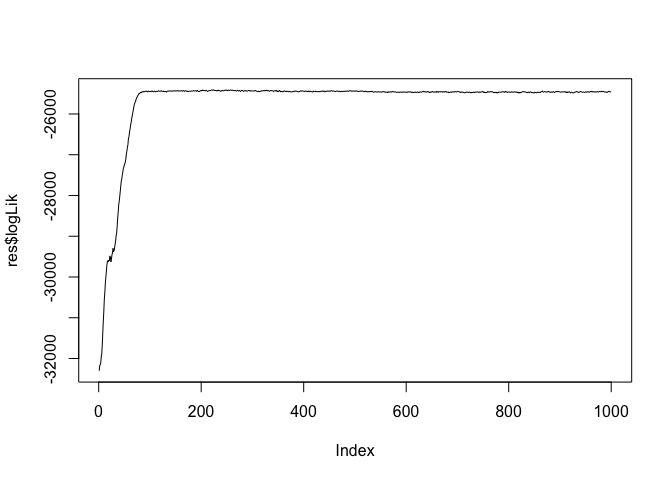

<!-- README.md is generated from README.Rmd. Please edit that file -->

# nlss

<!-- badges: start -->

<!-- badges: end -->

Network Latent Source Separation (nlss), a blind source separation
algorithm designed for network data.

## Installation

You can install the released version of nlss from
[CRAN](https://CRAN.R-project.org) with:

``` r
install.packages("nlss")
```

or from Github with:

``` r
library(devtools)
install_github("benwu233/nlss")
```

## Example

This is a basic example which shows you how to simulate networks with a
nlss model and estimate a nlss model with MCMC algorithm:

``` r
## basic example code
library(nlss)  
#> Loading required package: MCMCpack
#> Loading required package: coda
#> Loading required package: MASS
#> ##
#> ## Markov Chain Monte Carlo Package (MCMCpack)
#> ## Copyright (C) 2003-2019 Andrew D. Martin, Kevin M. Quinn, and Jong Hee Park
#> ##
#> ## Support provided by the U.S. National Science Foundation
#> ## (Grants SES-0350646 and SES-0350613)
#> ##
set.seed(233)

#simulate data with NLSS
sim0 = sim_NLSS(n_node = 50,n = 40,alpha = 0.5, beta = 0.5)

#check the dimension of the simulated data (n * n_node*(n_node-1)/2)
dim(sim0$X)
#> [1]   40 1225

#estimation (burn_in=0 here to track the whole log-likelihood tarce, it should be relatively large in application)
res = NLSS(data=sim0$X,q=3,total_iter = 1000, burn_in = 0, show_step=500)
#track the log-likelihood
plot(res$logLik, type = "l")
```


