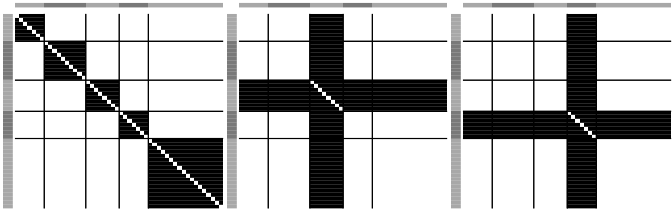
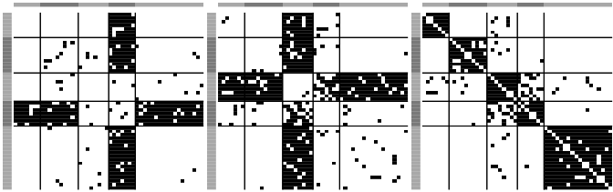

<!-- README.md is generated from README.Rmd. Please edit that file -->

# nlss

<!-- badges: start -->
<!-- badges: end -->

Network Latent Source Separation (nlss), a blind source separation
algorithm designed for network data.

## Installation

Install the released version of nlss from Github with:

``` r
devtools::install_github("benwu233/nlss")
```

## Example

This is a basic example which shows you how to use nlss:

We load the package and simulate networks with a NLSS model with three
latent source networks.

``` r
library(nlss)  
set.seed(612)

#simulate data with NLSS
sim = sim_NLSS(n_node = 50, n = 50, alpha_0 = c(3,2,1.5), alpha_1 = 2)
```

The true sources are:

``` r
heatmap.net(sim$S,lim = c(0,1), color = c("white","black"),
            community = sim$community, ncol=3)
```



Then, we solve the nlss model with the MCMC algorithm:

``` r
res = NLSS(data=sim$X, states = c(0,1), state0 = 0,
           q=3, q0=1,  total_iter = 5000, burn_in = 1000,
           thin = 10, show_step=1000, joint=TRUE)
```

We summarize the results:

``` r
sum_res = NLSS_sum(res,th=0.5, nstart = 1, nend = 400)
```

and print the estimated source networks:

``` r
heatmap.net(sum_res$S,lim = c(0,1), color = c("white","black"),
            community = sim$community,ncol=3)
```


