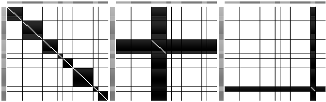
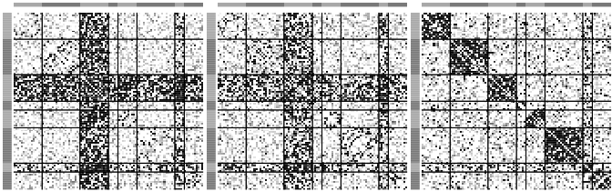
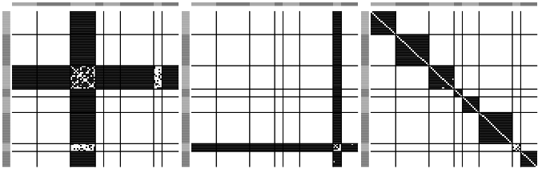

<!-- README.md is generated from README.Rmd. Please edit that file -->

# nlss

<!-- badges: start -->
<!-- badges: end -->

Network Latent Source Separation (NLSS), a blind source separation
algorithm designed for network data.

## Installation

Install the released version of nlss from Github with:

``` r
devtools::install_github("benwu233/nlss")
```

## Example

This is a basic example shows the implement of nlss package:

Load the package and generate three true latent source networks.

``` r
library(nlss)  
set.seed(716)
signal = gen_sources(100)
```

Draw the true sources.

``` r
library(gplots)
heatmap.net(signal$S,lim=c(0,1),
             community = signal$community,
             color = colorpanel(n = 100, low = "white", high = "black"))
```



Generate network data with NLSS.

``` r
sim0 = sim_NLSS(n = 150, alpha_0 = c(0.8,0.8,0.8),
                         alpha_1 = 0.8, sd0 = 0.25, signal$S)
```

Draw samples of the network data.

``` r
heatmap.net(sim0$Xc[1:3,],lim=c(0,1),
             community = signal$community,
             color = colorpanel(n = 100, low = "white", high = "black"))
```



Solve with the MCMC algorithm:

``` r
data0 = thr_byrow(sim0$Xc,0.1)
res = NLSS(data=data0, q=3, states = c(0,1), state0 = 0,
                      total_iter = 2000, burn_in = 0, thin = 10,
                      show_step=1000, joint=TRUE,
                      q0 = 3)
```

Summarize the results:

``` r
sum_res = NLSS_sum(res,th=0.95, nstart = 1, nend = 100)
```

Print the estimated source networks:

``` r
heatmap.net(sum_res$S,lim=c(0,1),
             community = signal$community,
             color = colorpanel(n = 100, low = "white", high = "black"))
```



Match and compare with the true sources:

``` r
S_match = match_source(signal$S, sum_res$S)
#>   |                                                                              |                                                                      |   0%  |                                                                              |========                                                              |  11%  |                                                                              |================                                                      |  22%  |                                                                              |=======================                                               |  33%  |                                                                              |===============================                                       |  44%  |                                                                              |=======================================                               |  56%  |                                                                              |===============================================                       |  67%  |                                                                              |======================================================                |  78%  |                                                                              |==============================================================        |  89%  |                                                                              |======================================================================| 100%
lapply(1:3, function(i){caret::confusionMatrix(as.factor(S_match[i,]), as.factor(signal$S[i,]), positive = "1" )} )
#> [[1]]
#> Confusion Matrix and Statistics
#> 
#>           Reference
#> Prediction    0    1
#>          0 4250    6
#>          1    0  694
#>                                           
#>                Accuracy : 0.9988          
#>                  95% CI : (0.9974, 0.9996)
#>     No Information Rate : 0.8586          
#>     P-Value [Acc > NIR] : < 2e-16         
#>                                           
#>                   Kappa : 0.995           
#>                                           
#>  Mcnemar's Test P-Value : 0.04123         
#>                                           
#>             Sensitivity : 0.9914          
#>             Specificity : 1.0000          
#>          Pos Pred Value : 1.0000          
#>          Neg Pred Value : 0.9986          
#>              Prevalence : 0.1414          
#>          Detection Rate : 0.1402          
#>    Detection Prevalence : 0.1402          
#>       Balanced Accuracy : 0.9957          
#>                                           
#>        'Positive' Class : 1               
#>                                           
#> 
#> [[2]]
#> Confusion Matrix and Statistics
#> 
#>           Reference
#> Prediction    0    1
#>          0 3570   84
#>          1    0 1296
#>                                          
#>                Accuracy : 0.983          
#>                  95% CI : (0.979, 0.9864)
#>     No Information Rate : 0.7212         
#>     P-Value [Acc > NIR] : < 2.2e-16      
#>                                          
#>                   Kappa : 0.957          
#>                                          
#>  Mcnemar's Test P-Value : < 2.2e-16      
#>                                          
#>             Sensitivity : 0.9391         
#>             Specificity : 1.0000         
#>          Pos Pred Value : 1.0000         
#>          Neg Pred Value : 0.9770         
#>              Prevalence : 0.2788         
#>          Detection Rate : 0.2618         
#>    Detection Prevalence : 0.2618         
#>       Balanced Accuracy : 0.9696         
#>                                          
#>        'Positive' Class : 1              
#>                                          
#> 
#> [[3]]
#> Confusion Matrix and Statistics
#> 
#>           Reference
#> Prediction    0    1
#>          0 4465    6
#>          1    0  479
#>                                           
#>                Accuracy : 0.9988          
#>                  95% CI : (0.9974, 0.9996)
#>     No Information Rate : 0.902           
#>     P-Value [Acc > NIR] : < 2e-16         
#>                                           
#>                   Kappa : 0.9931          
#>                                           
#>  Mcnemar's Test P-Value : 0.04123         
#>                                           
#>             Sensitivity : 0.98763         
#>             Specificity : 1.00000         
#>          Pos Pred Value : 1.00000         
#>          Neg Pred Value : 0.99866         
#>              Prevalence : 0.09798         
#>          Detection Rate : 0.09677         
#>    Detection Prevalence : 0.09677         
#>       Balanced Accuracy : 0.99381         
#>                                           
#>        'Positive' Class : 1               
#> 
```
