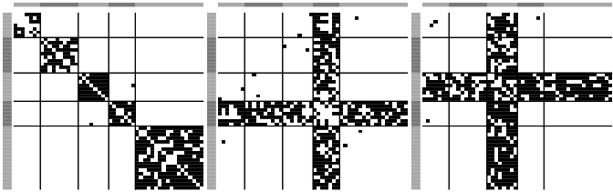

<!-- README.md is generated from README.Rmd. Please edit that file -->

# nlss

<!-- badges: start -->
<!-- badges: end -->

Network Latent Source Separation (NLSS), a blind source separation
algorithm designed for network data.

## Installation

Install the released version of nlss from Github with:

``` r
devtools::install_github("benwu233/nlss")
```

## Example

This is a basic example which shows you how to use nlss:

We load the package and simulate networks with a NLSS model with three
latent source networks.

``` r
library(nlss)  
set.seed(611)

#simulate data with NLSS
sim = sim_NLSS(n_node = 50, n = 50, alpha_0 = c(3,2,1.5), alpha_1 = 2)
```

The true sources are:

``` r
heatmap.net(sim$S,lim = c(0,1), color = c("white","black"),
            community = sim$community, ncol=3)
```


Then, we solve the NLSS model with the MCMC algorithm:

``` r
res = NLSS(data=sim$X, states = c(0,1), state0 = 0,
           q=3, total_iter = 2000, burn_in = 1000,
           thin = 10, show_step=1000, joint=TRUE)
```

We summarize the results:

``` r
sum_res = NLSS_sum(res,th=0.95, nstart = 1, nend = 100)
```

and print the estimated source networks:

``` r
heatmap.net(sum_res$S,lim = c(0,1), color = c("white","black"),
            community = sim$community, ncol=3)
```



Match and compare with the true sources:

``` r
S_match = match_source(sim$S, sum_res$S)
#>   |                                                                              |                                                                      |   0%  |                                                                              |========                                                              |  11%  |                                                                              |================                                                      |  22%  |                                                                              |=======================                                               |  33%  |                                                                              |===============================                                       |  44%  |                                                                              |=======================================                               |  56%  |                                                                              |===============================================                       |  67%  |                                                                              |======================================================                |  78%  |                                                                              |==============================================================        |  89%  |                                                                              |======================================================================| 100%
lapply(1:3, function(i){caret::confusionMatrix(as.factor(S_match[i,]), as.factor(sim$S[i,]), positive = "1" )} )
#> [[1]]
#> Confusion Matrix and Statistics
#> 
#>           Reference
#> Prediction   0   1
#>          0 956  62
#>          1   1 206
#>                                           
#>                Accuracy : 0.9486          
#>                  95% CI : (0.9347, 0.9603)
#>     No Information Rate : 0.7812          
#>     P-Value [Acc > NIR] : < 2.2e-16       
#>                                           
#>                   Kappa : 0.8361          
#>                                           
#>  Mcnemar's Test P-Value : 4.053e-14       
#>                                           
#>             Sensitivity : 0.7687          
#>             Specificity : 0.9990          
#>          Pos Pred Value : 0.9952          
#>          Neg Pred Value : 0.9391          
#>              Prevalence : 0.2188          
#>          Detection Rate : 0.1682          
#>    Detection Prevalence : 0.1690          
#>       Balanced Accuracy : 0.8838          
#>                                           
#>        'Positive' Class : 1               
#>                                           
#> 
#> [[2]]
#> Confusion Matrix and Statistics
#> 
#>           Reference
#> Prediction   0   1
#>          0 859 102
#>          1   2 262
#>                                           
#>                Accuracy : 0.9151          
#>                  95% CI : (0.8981, 0.9301)
#>     No Information Rate : 0.7029          
#>     P-Value [Acc > NIR] : < 2.2e-16       
#>                                           
#>                   Kappa : 0.7792          
#>                                           
#>  Mcnemar's Test P-Value : < 2.2e-16       
#>                                           
#>             Sensitivity : 0.7198          
#>             Specificity : 0.9977          
#>          Pos Pred Value : 0.9924          
#>          Neg Pred Value : 0.8939          
#>              Prevalence : 0.2971          
#>          Detection Rate : 0.2139          
#>    Detection Prevalence : 0.2155          
#>       Balanced Accuracy : 0.8587          
#>                                           
#>        'Positive' Class : 1               
#>                                           
#> 
#> [[3]]
#> Confusion Matrix and Statistics
#> 
#>           Reference
#> Prediction   0   1
#>          0 897 115
#>          1   6 207
#>                                           
#>                Accuracy : 0.9012          
#>                  95% CI : (0.8831, 0.9174)
#>     No Information Rate : 0.7371          
#>     P-Value [Acc > NIR] : < 2.2e-16       
#>                                           
#>                   Kappa : 0.714           
#>                                           
#>  Mcnemar's Test P-Value : < 2.2e-16       
#>                                           
#>             Sensitivity : 0.6429          
#>             Specificity : 0.9934          
#>          Pos Pred Value : 0.9718          
#>          Neg Pred Value : 0.8864          
#>              Prevalence : 0.2629          
#>          Detection Rate : 0.1690          
#>    Detection Prevalence : 0.1739          
#>       Balanced Accuracy : 0.8181          
#>                                           
#>        'Positive' Class : 1               
#> 
```

heatmap.net(res_sum\[\[3\]\]\[\[1\]\]$S,lim = c(0,1), color = c("white","black"),  community = sim$community,
ncol=3)

tmp0 = res_sum\[\[3\]\]\[\[50\]\]$S-1 table(tmp0) table(sum_res$S)
